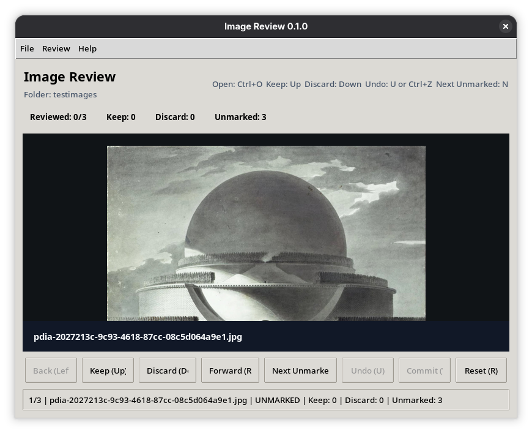

# demo-py-imagereview

A Python and Tkinter-based image review desktop app for triaging a folder of images.



## Run

```bash
uv run main.py
```

## Features

- Review one folder at a time without modifying files until commit
- Mark images as keep or discard with buttons or keyboard shortcuts
- Jump to the next unmarked image
- Undo the last mark or reset operation
- Commit only discarded files by moving them into a `DISCARDED` subfolder
- Reset all in-memory marks without touching files

## Shortcuts

- `Ctrl+O`: open folder
- `Up`: mark keep
- `Down`: mark discard
- `Left` / `Right`: previous or next image
- `N`: jump to next unmarked image
- `U` or `Ctrl+Z`: undo last action
- `W`: commit discards
- `R`: reset all marks
- `Esc`: exit

## Supported formats

- `.jpg`
- `.jpeg`
- `.png`
- `.tif`
- `.tiff`

## Dependencies

- Python 3.14.5 or later
- Tkinter (usually included as `python3-tkinter` in Linux distros)
- Pillow (Python Imaging Library fork)
